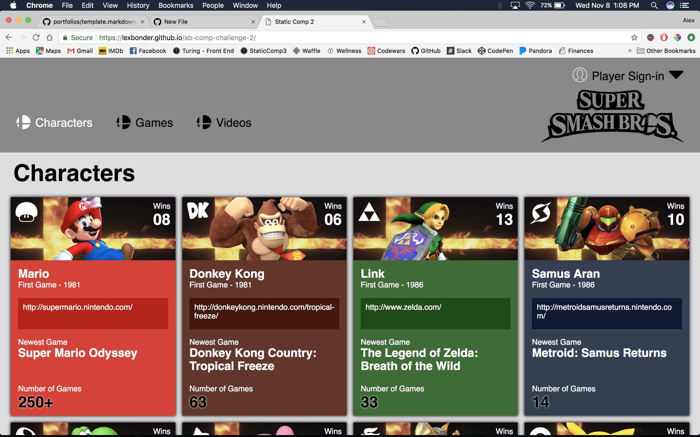

# Static Comp 2 - Alex Bonder - (FE Mod 2)

## Synopsis

  This was our second attempt at a static comp. This one focused on organizing cards, making sure that as the screen size gets smaller that the cards re-organized properly, When there were an odd number of cards, the remainder at the bottom was meant to shift over to the left rather than float in the middle.

  My feedback for this one included avoiding the glow behind the numbers in the bottom corner of the cards. I could have just used the darker version of the color as seen in the box for the link to present the number rather than having it glow.

## Project Goals

* Rebuild the structure of the original comp.
* Make the site responsive.

## Installation

Fork or clone this project

Open `index.html`

# Original Comp

# My Comp

